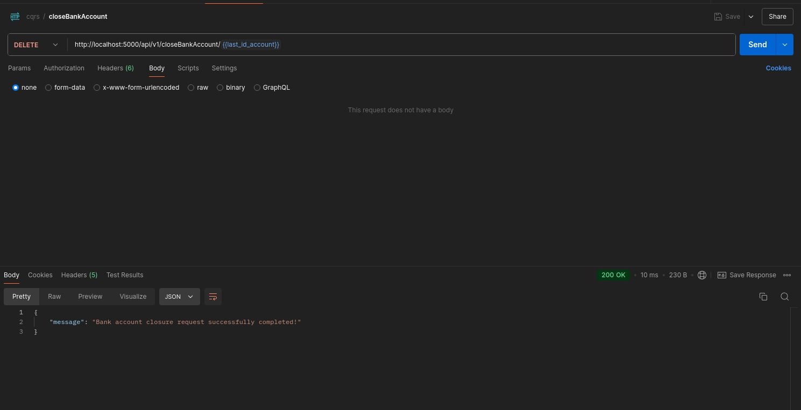
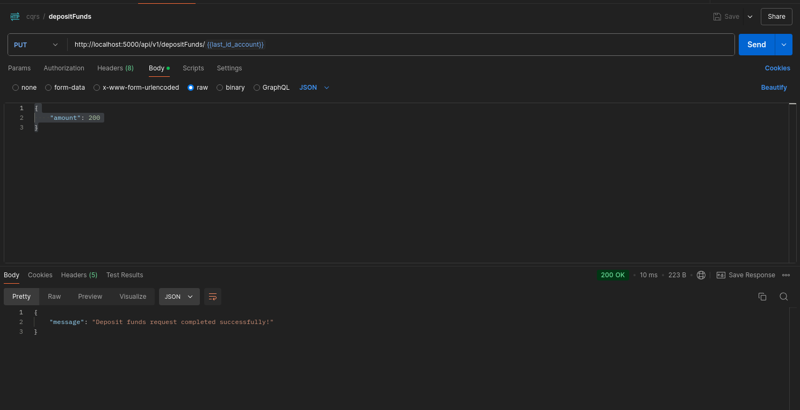
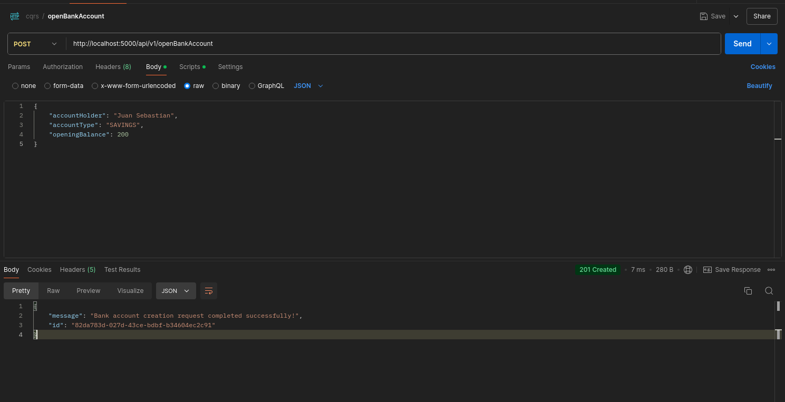
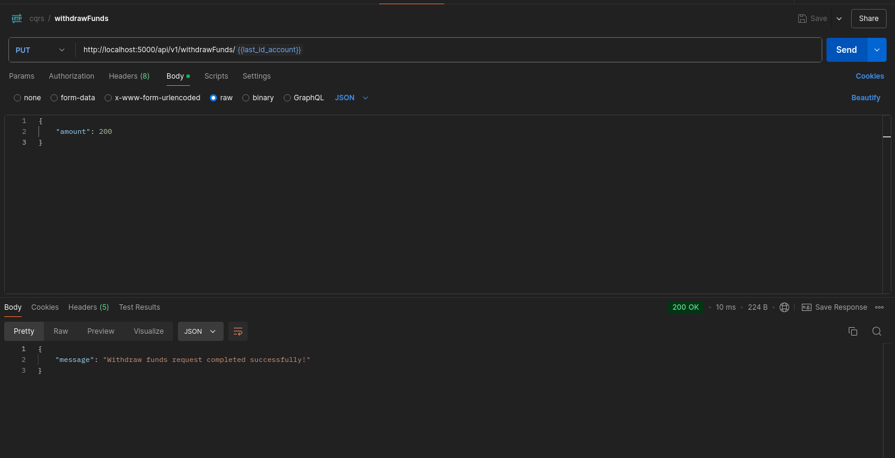
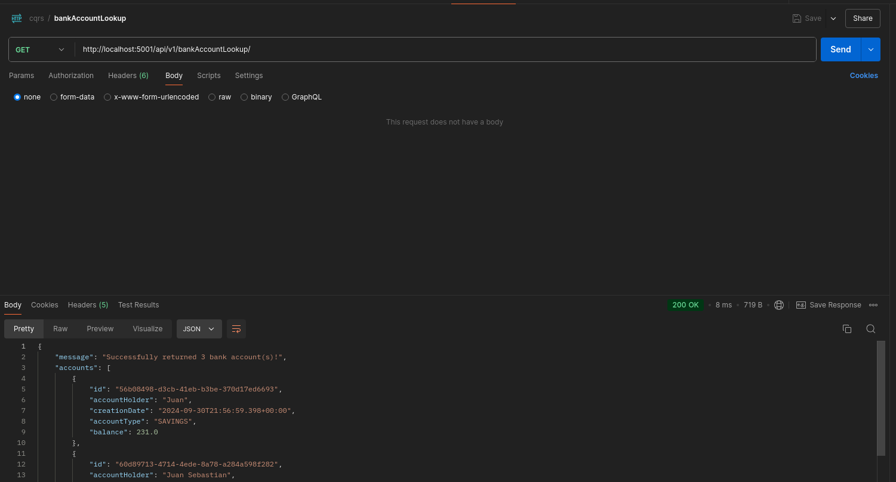
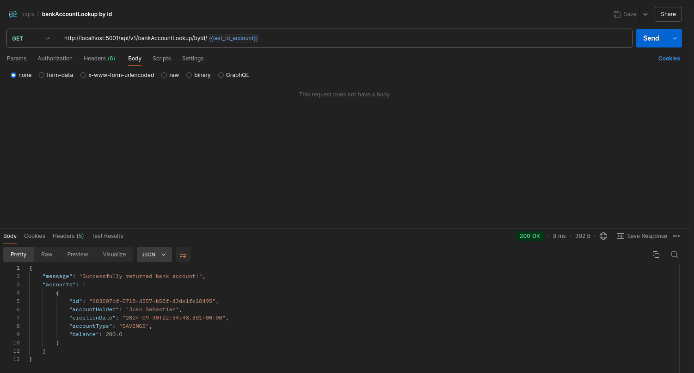
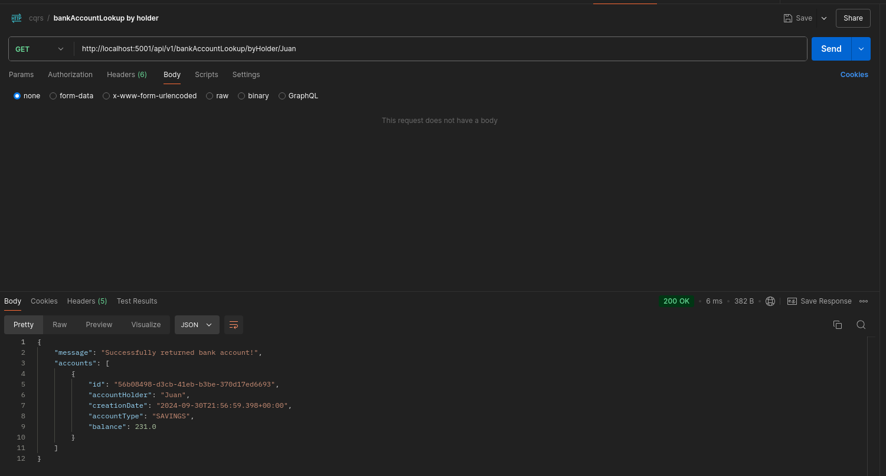
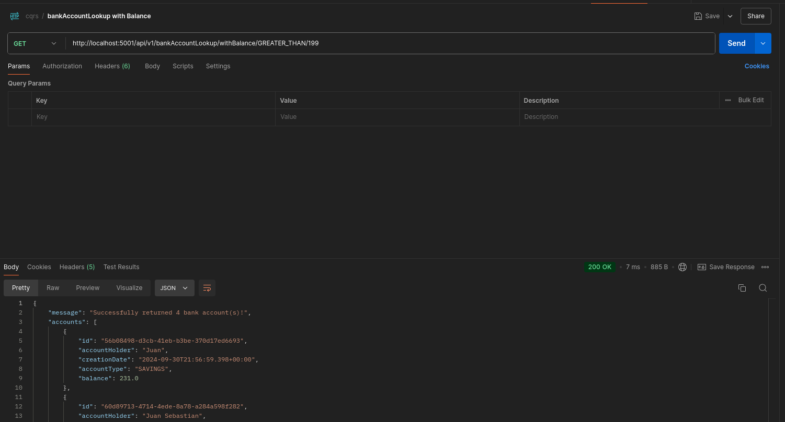
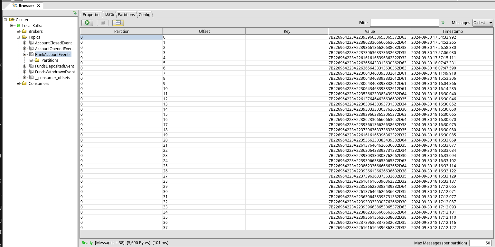

# Informe de Endpoints

## Account.cmd

### 1. Cerrar Cuenta Bancaria
- **URL**: `http://localhost:5000/api/v1/closeBankAccount/{id}`
- **Método HTTP**: `DELETE`
- **Cuerpo de la Solicitud**: No aplica.
- **Screenshoots**: 

### 2. Depositar Fondos
- **URL**: `http://localhost:5000/api/v1/depositFunds/{id}`
- **Método HTTP**: `PUT`
- **Cuerpo de la Solicitud**:
  ```json
    {
        "amount": <double>
    }
  ```
- **Screenshoots**: 

### 3. Abrir Cuenta Bancaria
- **URL**: `http://localhost:5000/api/v1/openBankAccount`
- **Método HTTP**: `POST`
- **Cuerpo de la Solicitud**:
  ```json
  {
    "accountHolder": "<string>",
    "accountType": "<string>",
    "openingBalance": <double>
  }
  ```
- **Screenshoot:** 

### 4. Restaurar Base de Datos de Lectura
- **URL**: `http://localhost:5000/api/v1/restoreReadDb`
- **Método HTTP**: `POST`
- **Cuerpo de la Solicitud**: No aplica.
- **Screenshots**: 

### 5. Retirar Fondos
- **URL**: `http://localhost:5000/api/v1/withdrawFunds/{id}`
- **Método HTTP**: `PUT`
- **Cuerpo de la Solicitud**:
  ```json
  {
    "amount": <double>
  }
  ```
- **Screenshots**: 

## Account.query

### 1. Obtener Todas las Cuentas Bancarias
- **URL Completa**: `http://localhost:5001/api/v1/bankAccountLookup/`
- **Método HTTP**: `GET`
- **Cuerpo de la Solicitud**: No aplica.
- **Screenshoots**: 

### 2. Obtener Cuenta Bancaria por ID
- **URL Completa**: `http://localhost:5001/api/v1/bankAccountLookup/byId/{id}`
- **Método HTTP**: `GET`
- **Parámetros en la URL**:
  - `{id}`: ID de la cuenta bancaria a obtener.
- **Cuerpo de la Solicitud**: No aplica.
- **Screenshoots**: 

### 3. Obtener Cuenta Bancaria por Titular
- **URL Completa**: `http://localhost:5001/api/v1/bankAccountLookup/byHolder/{accountHolder}`
- **Método HTTP**: `GET`
- **Parámetros en la URL**:
  - `{accountHolder}`: Nombre del titular de la cuenta bancaria.
- **Cuerpo de la Solicitud**: No aplica.
- **Screenshoots**: 

### 4. Obtener Cuentas Bancarias con un Saldo Específico
- **URL Completa**: `http://localhost:5001/api/v1/bankAccountLookup/withBalance/{equalityType}/{balance}`
- **Método HTTP**: `GET`
- **Parámetros en la URL**:
  - `{equalityType}`: Tipo de comparación (`GREATER_THAN` o `LESS_THAN`).
  - `{balance}`: Valor del saldo con el cual se realizará la comparación.
- **Cuerpo de la Solicitud**: No aplica.
- **Screenshoots**: 


# Documento de Cambios para Garantizar el Orden de Consumo de Eventos

## 1. **Descripción de los Cambios Implementados**

Se realizaron las siguientes modificaciones para garantizar que los eventos se consuman en el orden correcto durante el proceso de **Event Sourcing**:

### A. **Cambios en el Archivo de Configuración `application.yml`**

- Se añadió una nueva configuración en el archivo `application.yml` para usar un único **Kafka topic** para todos los eventos de la entidad `BankAccount`.
  
  ```yaml
  spring:
    kafka:
      producer:
        topic: BankAccountEvents
  ```

### B. **Modificaciones en el `AccountEventStore`**

- Se añadió un campo `topic` en la clase `AccountEventStore` para almacenar el topic de Kafka configurado en el `application.yml`.
  
  ```java
  @Value("${spring.kafka.topic}")
  private String topic;
  ```

- El método `produce` del productor de eventos ahora utiliza el topic configurado, en lugar de pasar el nombre del evento como antes:
  
  ```java
  eventProducer.produce(topic, event);
  ```

### C. **Actualización de `AccountEventSourcingHandler`**

- Similar a `AccountEventStore`, se agregó un campo `topic` para utilizarlo en la publicación de eventos en el único Kafka topic.
  
  ```java
  eventProducer.produce(topic, event);
  ```

### D. **Modificaciones en el `EventConsumer` y `AccountEventConsumer`**

- En el lado del consumidor, se actualizó el `AccountEventConsumer` para consumir todos los eventos desde el mismo Kafka topic. Además, se eliminó el manejo específico por tipo de evento, implementando un método general `consume(BaseEvent event)`:
  
  ```java
  @KafkaListener(topics = "${spring.kafka.topic}", groupId = "${spring.kafka.consumer.group-id}")
  public void consume(@Payload BaseEvent event, Acknowledgment ack) {
      // Invocación dinámica del handler adecuado basado en el tipo de evento
      eventHandlerMethod.invoke(eventHandler, event);
      ack.acknowledge();
  }
  ```

## 2. **Explicación Breve del Orden de Consumo de Eventos**

### Cómo se Garantiza el Orden de los Eventos

Para garantizar el orden de los eventos, todos los eventos relacionados con la entidad `BankAccount` se producen en un **único topic de Kafka**. Esto asegura que los eventos compartan el mismo offset de commit y se consuman en el orden exacto en el que fueron producidos.

Kafka asigna un número secuencial (offset) a cada mensaje en un topic. Dado que todos los eventos relacionados con una entidad específica se almacenan en el mismo topic, el consumidor procesará los eventos en el orden en que fueron producidos, garantizando así la secuencia correcta de operaciones como apertura de cuenta, depósitos, retiros y cierre de cuenta.

### Importancia en CQRS y Event Sourcing

En arquitecturas basadas en **CQRS (Command Query Responsibility Segregation)** y **Event Sourcing**, el orden de los eventos es crucial para mantener la consistencia del estado de las entidades. Cada evento representa un cambio en el estado de la entidad y se reproduce secuencialmente para reconstruir su estado actual. Si los eventos se consumieran fuera de orden, el estado de la entidad podría corromperse, llevando a inconsistencias y fallos en el sistema.

Al usar un único Kafka topic y procesar los eventos en el mismo orden en que fueron emitidos, se asegura que cada cambio en la entidad se aplique de manera correcta y secuencial, preservando la integridad del estado a lo largo del tiempo.


## 3. Capturas de pantalla y explicación de la prueba de reproducción de eventos

### Captura de Pantalla: Eventos de Kafka en Tópico `BankAccountEvents`



En esta captura, podemos ver el **visor de tópicos de Kafka** mostrando los eventos dentro del tópico `BankAccountEvents`. Este tópico registra los diferentes eventos relacionados con la cuenta bancaria, como la apertura de cuenta, depósitos, retiros, entre otros.

#### Explicación de la Prueba:

1. **Tópico de Kafka (`BankAccountEvents`)**:
   - La captura muestra que los eventos están siendo publicados en el tópico correspondiente, lo que garantiza la persistencia y la capacidad de reproducir los eventos cuando sea necesario.
   - Los **offsets** enumerados indican el orden de los eventos en el tiempo, asegurando que los consumidores puedan procesar los eventos en la misma secuencia en que fueron producidos.

2. **Campos visibles en la captura**:
   - **Partition**: Todos los eventos están siendo publicados en la partición `0`, lo que indica que los eventos de esta entidad están en la misma partición, asegurando el orden.
   - **Offset**: El número de offset representa la posición del evento dentro de la partición. Es esencial para la reproducción de eventos, ya que permite que los consumidores recuperen el estado en el orden correcto.
   - **Key** y **Value**: Estos campos indican la clave y el valor del evento en formato serializado. En este caso, parece que se están utilizando identificadores únicos para cada evento (`Key`) y los datos del evento (`Value`), que probablemente estén serializados en formato binario o JSON.
   - **Timestamp**: El campo de timestamp confirma el momento exacto en que se produjo cada evento, lo que es crucial para la auditoría y el monitoreo del flujo de eventos en tiempo real.

3. **Reproducción de eventos**:
   - Durante la prueba de reproducción de eventos, los consumidores pueden leer los eventos a partir de un offset específico para reconstruir el estado actual de la entidad `BankAccount` paso a paso, siguiendo el orden temporal correcto de los eventos.
